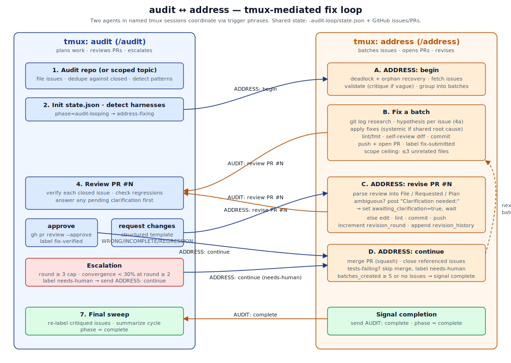
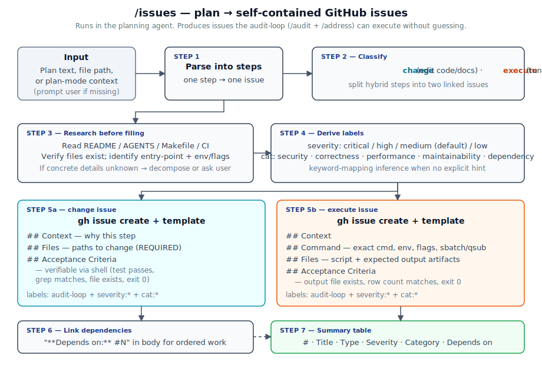

# audit-loop

> **Note**: This project was built with [Claude Code](https://claude.ai/claude-code). Code, documentation, and commit messages were AI-generated with human direction and review.

Agent-agnostic skills that orchestrate an automated audit-fix loop between any two AI coding agents via tmux, using GitHub issues and PRs as the shared state store.

## Skills

| Skill | Role | Location | Purpose |
|---|---|---|---|
| `/audit` | Auditor | `audit/SKILL.md` | Audit the repo or review a specific PR, then iterate with the address agent |
| `/address` | Fixer | `address/SKILL.md` | Fix issues in batched PRs, handle review feedback |
| `/issues` | Planner | `issues/SKILL.md` | Create GitHub issues from a plan for the address agent to pick up |

Works with any agent that supports the Agent Skills standard (Claude Code, Codex CLI, Copilot CLI, Gemini CLI, etc.).

## How it works



## Setup

Symlink into whichever agent skill directories you use:
```bash
# Any agent that reads ~/.agents/skills/ (Codex CLI, Copilot CLI)
ln -s /path/to/audit-loop/audit ~/.agents/skills/audit
ln -s /path/to/audit-loop/address ~/.agents/skills/address
ln -s /path/to/audit-loop/issues ~/.agents/skills/issues

# Claude Code specifically
ln -s /path/to/audit-loop/address ~/.claude/skills/address
ln -s /path/to/audit-loop/audit ~/.claude/skills/audit
ln -s /path/to/audit-loop/issues ~/.claude/skills/issues
```

### tmux sessions

Start two named tmux sessions — names must be `audit` and `address`:
```bash
tmux new -s audit
tmux new -s address
```

In both sessions, `cd` to the target repo and start your chosen agent.

Ensure `gh` CLI is authenticated with repo access. Both skills also run `gh auth status` before their first GitHub command and stop immediately if auth is broken.

## Usage

- **Repo mode:** In the `audit` session, run `/audit`. Everything else is automatic.
- **Topic mode:** Run `/audit documentation` (or `security`, `tests`, etc.) to audit only that topic.
- **PR mode:** Run `/audit #42` to review a specific PR and iterate with the address agent until it's clean.

### Repo mode

1. The audit agent audits the repo and opens GitHub issues (labeled `audit-loop` + severity + category)
2. The audit agent sends `/address ADDRESS: begin` to the address agent via tmux
3. The address agent validates each issue (clear scope, concrete criteria, real files). Unclear issues get a comment and lose the `audit-loop` label.
4. The address agent groups valid issues into batches, writes root cause hypotheses, fixes batch 1, opens a PR
5. The address agent sends `AUDIT: review PR #N` to the audit agent
6. The audit agent reviews the PR:
   - **Approve** -> address agent merges and starts the next batch
   - **Request changes** (structured `WRONG|INCOMPLETE|REGRESSION` feedback) -> address agent revises
7. While one agent is waiting on the other, it re-runs the timeout check every 5 minutes; during long work, it refreshes heartbeat state so crashes still trip the watchdog.
8. Repeat until all issues are addressed or safety caps are hit
9. The audit agent does a final sweep: revises any critiqued issues, re-labels them, and triggers another round if needed

### Manual mode

`/address` also works standalone (without the audit loop). Paste findings inline or provide a file path:
```
/address path/to/findings.md
/address  (then paste findings)
```

### PR mode

Run `/audit #N` to review an existing PR. The audit agent reviews the diff, posts structured feedback, and triggers the address agent to push fixes to the same PR branch. Useful when another agent (or a human) has already opened a PR and you want the audit loop to refine it.

### Feature mode

You can also use the loop to implement new features. Plan the feature (e.g. using plan mode), then run `/issues` to create `audit-loop`-labeled issues from the plan. Start the address agent with `ADDRESS: begin` — the audit agent reviews each PR as a quality gate.



## Trigger Protocol

Audit -> Address (telling the address agent to fix):
```
/address ADDRESS: begin      # first trigger, loads the skill
ADDRESS: continue             # PR approved, merge and do next batch
ADDRESS: revise PR #N         # changes requested, revise
```

Address -> Audit (telling the audit agent to review):
```
AUDIT: review PR #N           # PR ready for review
AUDIT: complete                # all batches done
```

**Important:** Trigger phrases must be sent with a trailing space inside the quotes (e.g. `"AUDIT: review PR #4 "`) because Copilot CLI autocompletes `#<number>` references - without the space, Enter selects a suggestion instead of submitting the literal text. The text and `Enter` must also be sent as separate bash calls; chaining with `&&` or `;` causes a newline instead of submit.

## Safety Caps

- **5 PRs max** per audit cycle
- **3 revision rounds max** per PR
- **30-minute timeout** for normal operations, measured against the latest trigger or heartbeat
- **2-hour timeout** for clarification requests
- **5-minute watchdog poll** while waiting on the peer agent
- Exceeded caps -> `needs-human` label, move on

## State

Loop state is stored in `{repo}/.audit-loop/state.json` (gitignored). This enables crash recovery — both agents check state.json on session restart to resume where they left off. The file also carries `last_heartbeat_time` and `heartbeat_actor` so the timeout can detect stalls even when no new trigger arrives.

Hypotheses are written to `{repo}/.audit-loop/batch-N-hypotheses.md` before any code is edited, and copied into the PR description.

## Labels

### Static (set at issue creation)
- `audit-loop`, `severity:{critical,high,medium,low}`, `cat:{security,correctness,performance,maintainability,dependency}`

### State transitions (IssueOps FSM)
- `in-progress` -> `fix-submitted` -> `fix-verified` -> closed

### Control
- `needs-human`, `tests-failing`, `audit-batch-{N}`

## Anti-Thrashing

- **Hypothesis gate**: Addressing agent must articulate root cause, fix, and risk before editing
- **Structured reviews**: Auditing agent uses `WRONG|INCOMPLETE|REGRESSION` classifiers with specific file/behavior/change fields
- **Nitpick guard**: Auditing agent approves if functionally correct, no style-only rejections
- **Convergence detection**: At revision round 2, if diffs are cancelling out, escalate instead of looping
- **Clarification flow**: Addressing agent asks instead of guessing on ambiguous feedback
- **Heartbeat watchdog**: Waiting agents poll every 5 minutes, and working agents refresh heartbeat state during long tasks
- **Scope ceiling**: Systemic fixes limited to 3 extra files; larger fixes get their own issue
- **Duplicate detection**: Auditing agent reopens prior issues with escalated severity instead of filing duplicates
